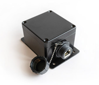

# MotionNode POE Tutorial

<table><tr>
<td>

- **[Overview](#overview)**
- **[Bonjour / Avahi / MDNS / Zeroconf](#bonjour--avahi--mdns--zeroconf)**
- **[Run the example](#run-the-example)**
- **[Example usage](#example-usage)**
- **[Setting location](#setting-location)**
- **[Setting a static IP address](#setting-a-static-ip-address)**
- **[Removing a configured static IP address](#removing-a-configured-static-ip-address)**

</td>
<td>



</td>
</tr></table>

## Overview

This tutorial shows how to stream data from one or more MotionNode POE devices on your local area network.  There are two options for streaming:

### 1. [Connect directly to a single MotionNode POE device](./README_direct_connect.md)

This option does not require the MotionNode software on the host -- it is a python-only solution.  It requires no external software on the host; only the python scripts included in this repository are needed. This is a good option for:

- lower powered devices
- platforms not supported by the MotionNode software
- if you only want to connect to a single MotionNode POE device.
  
Please see the separate [Direct Connect Tutorial](./README_direct_connect.md)

### 2. Connect to the MotionNode service on the host

This option requires the [MotionNode software](https://www.motionnode.com/software) to be running on the host.  It is more robust in that you can aggregate data-streams from one or more MotionNode devices.  This allows for reading any combination of [MotionNode POE](https://www.motionnode.com/poe-ip68), or [MotionNode USB](https://www.motionnode.com/usb) devices connected to the host. 

The [included python example](../scripts/example.py) will stream measurement and motion data from the MotionNode POE device, printing out the data in CSV format in a terminal or streaming to a CSV file.

Each sample in time is one row. Each column is one channel from the connected MotionNode POE device.

## Zeroconf / Bonjour / Avahi / MDNS

The MotionNode POE device runs a Zeroconf service so you can easily find its IP address assigned by DHCP on the local network.  It broadcasts the **_motionnode._tcp** service type.  The included MotionNodePOEBrowser python class allows simple scanning of any MotionNode devices on the local network using Zeroconf.

*Note: alternatively, you may set a static IP address on the MotionNode POE device.  Instructions for static IP assignment are [here](README.md#setting-a-static-ip-address).*

## Run the example

By default, the example application will read as many samples as possible and print them to the standard output. The samples are printed as they arrive, every ~10 milliseconds.

Edit the code to select which channels you want to read.  By default, this example streams the accelerometer (a), magnetometer (m), gyro (g), and Euler angles (r).

Configurable channels are documented in [configurable.xml](https://storage.googleapis.com/shadowmocap/configurable.xml)

This example script first stops, scans, and starts reading from any connected MotionNode devices.  It prints out the list of connected nodes, which are available to the user as a dictionary.

Connect your MotionNode POE device to your network using a POE-enabled network switch or router, and wait a bit (30-40 seconds) for it to boot up.  Then, run the example from your host.  The example code is located in [python-streaming](../python-streaming/example.py) path:

```
cd ../scripts
python example_stream.py
```

If it finds one or more MotionNode POE devices on the network, it will connect to them and start streaming.  Example output with one device connected:

```
MotionNode PoE Devices:
['192.168.1.146', 'fe80::b0a3:c446:404e:2385']

Reading from:
Node key: 2
  name: Node01
  uuid: 24d8c620-465b-490e-9884-f74644dd123b
  sampling-rate: 100 Hz
  accel-range: 2 g

-0.00952163,1.01136792,-0.04016175,10.69657421,45.22774124,-4.15045404,-0.02362077,-0.22102159,0.18699004,-3.11896849,-1.09135723,-3.12384486
-0.00769055,1.0073396,-0.03930724,10.68131542,45.13618851,-4.1809721,-0.07295998,0.07228143,0.12081642,-3.11892891,-1.0913769,-3.12389922
-0.00781262,1.01014721,-0.03845274,10.66605663,45.13618851,-4.10467672,-0.12853454,0.23180881,0.04638677,-3.11893153,-1.09144163,-3.12392402
-0.01000992,1.01100171,-0.03881895,10.65079689,45.19722366,-4.10467672,-0.0713084,0.12329575,-0.09136621,-3.1189971,-1.09150708,-3.12386441
-0.00854505,1.0123446,-0.03930724,10.60502052,45.27351761,-4.05889988,-0.19259319,0.26481411,-0.02843115,-3.11904097,-1.09162188,-3.12384987
-0.00646983,1.00929272,-0.04016175,10.711833,45.2887764,-4.11993599,-0.00538558,-0.33882296,-0.09137827,-3.11904454,-1.09162569,-3.12383628
...
```

Each MotionNode device has a unique **uuid** string.  This string can be useful to apply the same node's data to a specific data related task, regardless of the order in which the devices are enumerated (which may change, based on how the MotionNode POE devices are scanned on the network).

This example script also shows how to set the accelerometer sensitivity.  Each MotionNode device is calibrated at two sensitivities: ±2g and ±8g.  

The sampling rate can also be specified in Hz (fps).  Valid values are: [100, 200, 400, 500, 1000]

```
python example_stream.py  --help

usage: example_stream.py [-h] [--file FILE] [--frames FRAMES] [--header]
                  [--host HOST] [--port PORT]

optional arguments:
  -h, --help       show this help message and exit
  --file FILE      output file
  --frames FRAMES  read N frames
  --header         show channel names in the first row
  --host HOST      IP address of the Motion Service
  --port PORT      port number of the Motion Service
  --accel-range    accelerometer range (sensitivity)
  --sampling-rate  sampling rate in Hz
  --search         search for a MotionNode POE device using Zeroconf.
```

## Example usage

1. Output the stream to a csv file which you can open in spreadsheet editor (Openoffice, Libreoffice, Excel).  Include a header on the first line of the csv file.  The file is specified relative to the current working directory, or can be specified as a full path relative:

```console
python example_stream.py --header --file ./streamed_data.csv
```

2. Output the stream to the terminal, and include the header showing channel names

```console
python example_stream.py --header
```

3. Specify the accelerometer sensitivity.  Select ±8g:

```console
python example_stream.py --accel-range 8
```

4. Specify the sampling rate.  Select 1000 Hz:

```console
python example_stream.py --sampling-rate 1000
```

5. Motion SDK uses TCP/IP sockets, so it is easy to stream over the network as shown in this example.  By default, the script connects to the MotionNode service running on **localhost** (127.0.0.1).  If you want to connect to the MotionNode service on a different host, you can specify its IP address. For example, for a host with ip address 192.168.1.100:

```console
python example_stream.py --host 192.168.1.100
```

## Setting location

The MotionNode POE device will produce the most accurate heading output when you set the geographic location, which accounts for the Earth's variable magnetic field.  Please refer to the instructions on [setting location](../README.md#setting-location) in the main README.

## Setting a static IP address

You can configure the MotionNode POE device to use a static IP address if you prefer to not use DHCP on your network for IP address assignment, or if it is more convenient.  

Please note that you can choose to either set the gateway and dns resolution ip addresses, or leave them blank.  If you leave them blank, then the MotionNode POE device will attempt to set its gateway and dns resolution ip addresses using DHCP. 

To set the static IP address, two options are available:  either use the web browser interface on the device, or use the included python [set_static_ip](../scripts/set_static_ip.py) script.

### Option 1. Use the web browser interface

Connect the MotionNode POE device to the network and wait a bit (30-40 seconds) for it to boot up.  Open a web browser and browser to its console:

[http://motionnode.local:32080/#/console](http://motionnode.local:32080/#/console)

Alternatively, if your MotionNode POE has a static IP assigned already (say, 192.168.1.201), you would browse to it directly:

[http://192.168.1.201:32080/#/console](http://192.168.1.201:32080/#/console)

In this example let's say that we would like to assign a new static ip of **192.168.1.100**. In the console command entry box, run the following command:

```
=node.system.set_default("static_ip", "192.168.1.100")
=node.system.set_default("static_gateway", "192.168.1.1")
=node.system.set_default("static_dns", "8.8.8.8,8.8.4.4")
```

Note that the *static_gateway* and *static_dns* are not strictly necessary, if your network delivers this information via DHCP, or if you do not wish for the device to pass traffic through the gateway.

Now reboot the MotionNode POE device by unplug/plug power cycling.  After giving it time to boot up, you can ping it to verify the new IP address is correctly configured:

```
ping 192.168.1.100
```

### Option 2. Use the Python set_static_ip script

You can set a static ip address using the included [set_static_ip](../scripts/set_static_ip.py) script.   Please see the [set_static_ip README](../README_tools.md#set_static_ip-script) for usage.


## Removing a configured static IP address

You can revert to using DHCP and remove a static IP configuration.  Once the static IP address is removed, the MotionNode POE device will be receive an IP address via DHCP.  In this example the currently configured static IP address is **192.168.1.201**.

### Option 1. Use the web browser interface

Connect the MotionNode POE device to the network and wait a bit (30-40 seconds) for it to boot up.  Open a web browser and browser to its console:

[http://192.168.1.201:32080/#/console](http://192.168.1.201:32080/#/console)

In the console command entry box, run the following command:

```
=node.system.set_default("static_ip", "")
=node.system.set_default("static_gateway", "")
=node.system.set_default("static_dns", "")
```

Now reboot the MotionNode POE device by unplug/plug power cycling.  After giving it time to boot up, you can ping it to verify the new IP address is correctly configured (assigned by DHCP server on your network):

```
ping motionnode.local
```

### Option 2. Use the Python set_static_ip script

Remove a static ip using the [set_static_ip](../scripts/set_static_ip.py) script.   Please see the [set_static_ip README](../README_tools.md#removing-a-static-ip) for usage.


